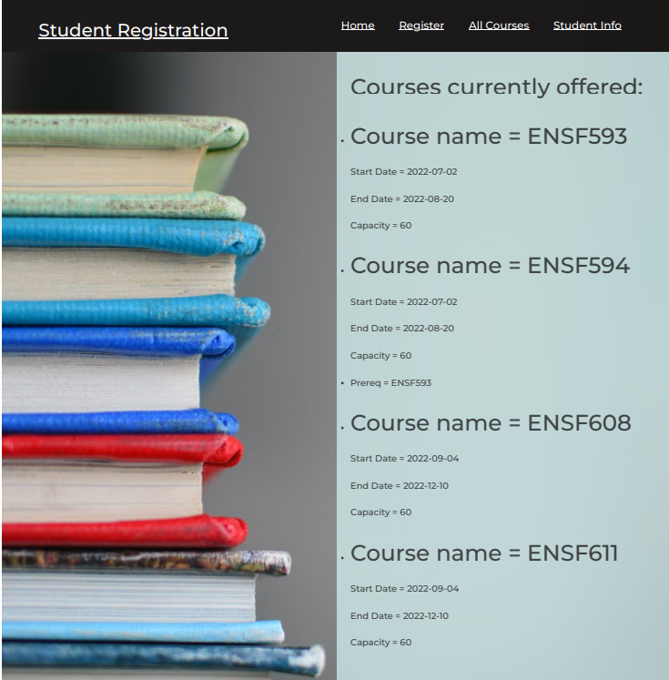

# ENSF607project

## Screenshots


## How to start your backend?
The backend was previously hosted on AWS, but in the interest of not incurring any further costs associated with hosting an API, database, and front-end, it has been taken down. Please reach out to the repo owner for a demonstration / further questions.

To start the project, after downloading the file:

1. In MySQL, run script

```
CREATE DATABASE project_database;
```

2. Ensure MySQL server is running
3. In `application.properties`, ensure the following settings are set:

```
spring.datasource.url=jdbc:mysql://localhost:3306/project_database
spring.datasource.username=root
spring.datasource.password=1111
spring.jpa.hibernate.ddl-auto=create-drop
spring.jpa.show-sql=true
spring.jpa.properties.hibernate.dialect=org.hibernate.dialect.MySQL5Dialect
spring.jpa.properties.hibernate.format_sql=true
server.error.include-message=always
```

Replace 1111 with your MySQL root password.
Replace 3306 in line 1 with your MySQL port number (under connection details in MySQL workbench)

4. Start server by starting the `Assignment6Application.java` under \src\main\java\course\ensf607\assignment6\Assignment6Application.java

5. Note what port your application starts (8080 by default). Look for a line in your console output that looks something like `Tomcat initialized with port(s): 8080 (http)`

6. With your server running open Postman, add a couple new courses and students by:
   - Creating a new POST request to: `http://localhost:8080/api/v1/course`.
     - Note that you can't post more than one course with the same name
   - Create a new POST request to: `http://localhost:8080/api/v1/student`
     - Note that you can't post more than one student with the same UCID

You can now assign students to courses by running a PUT request to `http://localhost:8080/api/v1/course/X/students/Y` (X is the internal ID of the course (internally generated by server, ex 1, 2, 3, etc), the Y is internal ID of student generated by server, ex 1, 2, 3 etc )

Same idea for assignPrereqToCourse, except make a PUT request to `http://localhost:8080/api/v1/course/X/course/X`. Same format as above. X`!=`X, cause that crashes the program.
